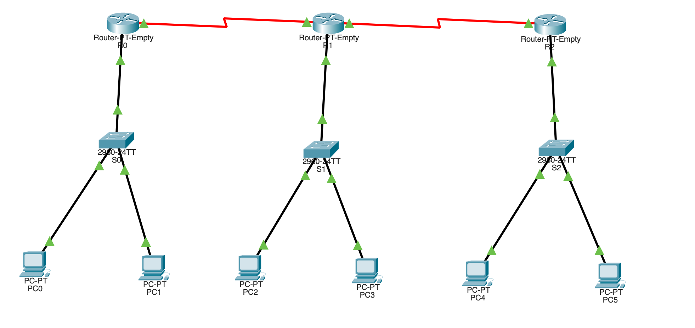
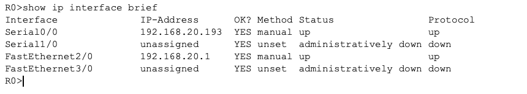
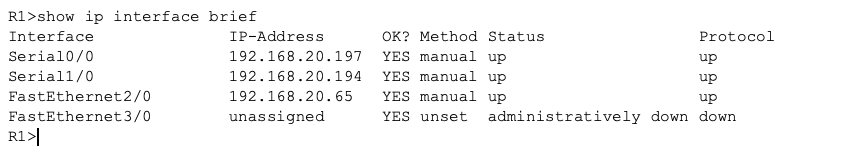
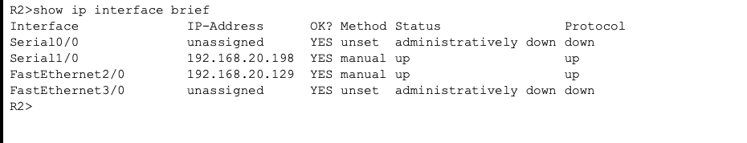

# Computer Networks Lab Practicals: Cisco Packet Tracer

**Repository**: [github.com/gurleennaroraa/Computer-Network-Test](https://github.com/gurleennaroraa/Computer-Network-Test)  
**Author**: Gurleen Arora (GitHub: [@gurleennaroraa](https://github.com/gurleennaroraa/Computer-Network-Test))  
**Instructor / Evaluator**: `anirudhg@srmist.edu.in`  

---

## 📑 Table of Contents

1. [Practical 15 – Configuring RIPv2 (Classless) Routing with VLSM](#practical-15--configuring-ripv2-classless-routing-with-vlsm)
   - [Objective & Aim](#1-aim--objective)
   - [Key Concepts: RIPv1 vs RIPv2 & VLSM](#2-key-concepts)
   - [Network Topology](#3-network-topology)
   - [VLSM IP Addressing Scheme](#4-vlsm-ip-addressing-scheme)
   - [Router Configurations](#5-router-configurations)
   - [Verification & Routing Table](#6-verification--testing)
   - [Packet Tracer File](#7-packet-tracer-file)
2. [Practical 16 – Configuring BGP (Border Gateway Protocol) Routing](#practical-16--configuring-bgp-border-gateway-protocol-routing)
   - [Objective & Aim](#1-aim--objective-1)
   - [Key Concepts: BGP & Autonomous Systems (AS)](#2-key-concepts-1)
   - [Network Topology](#3-network-topology-1)
   - [IP Addressing Scheme](#4-ip-addressing-scheme)
   - [Router Configurations (AS 100 & AS 200)](#5-router-configurations-1)
   - [BGP Summary & Verification](#6-bgp-summary--verification)
   - [Packet Tracer File](#7-packet-tracer-file-1)
3. [Summary & Conclusions](#summary--conclusions)

---

# Practical 15 – Configuring RIPv2 (Classless) Routing with VLSM

## 1. Aim & Objective
To configure and verify **RIPv2 (Routing Information Protocol version 2)** using **Variable Length Subnet Masking (VLSM)** on a multi-router topology in Cisco Packet Tracer, ensuring classless routing updates and end-to-end network connectivity.

## 2. Key Concepts

| Feature | RIPv1 | RIPv2 |
| :--- | :--- | :--- |
| **Type** | Classful Protocol | Classless Protocol |
| **Subnet Mask in Updates** | ❌ No (Assumes default class mask) | ✅ Yes (Transmits subnet masks) |
| **VLSM Support** | ❌ Not Supported | ✅ Fully Supported |
| **Update Delivery** | Broadcast (`255.255.255.255`) | Multicast (`224.0.0.9`) |
| **Auto-Summarization** | Mandatory (Always ON) | Configurable (`no auto-summary`) |
| **Authentication** | None | Supported (Plaintext & MD5) |

---

## 3. Network Topology

The network consists of:
- **3 Routers (R0, R1, R2)** connected via serial links (`se0/0` and `se1/0`)
- **3 Switches (S0, S1, S2)** connected to router FastEthernet interfaces (`fa2/0`)
- **6 End PCs (PC0 – PC5)** assigned across the three subnets


*Figure 15.1: Practical 15 Complete Network Topology*

---

## 4. VLSM IP Addressing Scheme

All subnets are partitioned from a single Class C network block `192.168.20.0/24`:

| Subnet | Network Address | Subnet Mask | Devices Connected |
| :--- | :--- | :--- | :--- |
| **LAN 1** | `192.168.20.0/26` | `255.255.255.192` | R0 (`fa2/0`), PC0, PC1 |
| **LAN 2** | `192.168.20.64/26` | `255.255.255.192` | R1 (`fa2/0`), PC2, PC3 |
| **LAN 3** | `192.168.20.128/26` | `255.255.255.192` | R2 (`fa2/0`), PC4, PC5 |
| **WAN Link 1** | `192.168.20.192/30` | `255.255.255.252` | R0 (`se0/0`) ↔ R1 (`se1/0`) |
| **WAN Link 2** | `192.168.20.196/30` | `255.255.255.252` | R1 (`se0/0`) ↔ R2 (`se1/0`) |

### PC Configuration Table

| Host | IP Address | Subnet Mask | Default Gateway |
| :--- | :--- | :--- | :--- |
| **PC0** | `192.168.20.10` | `255.255.255.192` | `192.168.20.1` |
| **PC1** | `192.168.20.11` | `255.255.255.192` | `192.168.20.1` |
| **PC2** | `192.168.20.70` | `255.255.255.192` | `192.168.20.65` |
| **PC3** | `192.168.20.71` | `255.255.255.192` | `192.168.20.65` |
| **PC4** | `192.168.20.140` | `255.255.255.192` | `192.168.20.129` |
| **PC5** | `192.168.20.141` | `255.255.255.192` | `192.168.20.129` |

---

## 5. Router Configurations

### R0 Configuration
```cisco
enable
configure terminal
hostname R0

interface fa2/0
 ip address 192.168.20.1 255.255.255.192
 no shutdown
exit

interface se0/0
 ip address 192.168.20.193 255.255.255.252
 clock rate 64000
 no shutdown
exit

router rip
 version 2
 no auto-summary
 network 192.168.20.0
exit

write memory
```

  
*Figure 15.2: R0 Interface Status (show ip interface brief)*

---

### R1 Configuration
```cisco
enable
configure terminal
hostname R1

interface fa2/0
 ip address 192.168.20.65 255.255.255.192
 no shutdown
exit

interface se1/0
 ip address 192.168.20.194 255.255.255.252
 no shutdown
exit

interface se0/0
 ip address 192.168.20.197 255.255.255.252
 clock rate 64000
 no shutdown
exit

router rip
 version 2
 no auto-summary
 network 192.168.20.0
exit

write memory
```

  
*Figure 15.3: R1 Interface Status (show ip interface brief)*

---

### R2 Configuration
```cisco
enable
configure terminal
hostname R2

interface fa2/0
 ip address 192.168.20.129 255.255.255.192
 no shutdown
exit

interface se1/0
 ip address 192.168.20.198 255.255.255.252
 no shutdown
exit

router rip
 version 2
 no auto-summary
 network 192.168.20.0
exit

write memory
```

  
*Figure 15.4: R2 Interface Status (show ip interface brief)*

---

## 6. Verification & Testing

### Routing Table on R0 (`show ip route`)
The routing table displays variable subnetting (5 subnets, 2 masks: `/26` and `/30`) learned dynamically via RIPv2 (`R`):

  
*Figure 15.5: R0 Routing Table verifying VLSM routes*

### End-to-End Connectivity Ping Test
Ping from PC0 (`192.168.20.10`) to PC4 (`192.168.20.140`):

  
*Figure 15.6: Successful Ping Verification across VLSM subnets*

## 7. Packet Tracer File
- Download PKT file: [`practical 15/RIPv2_Practical 15.pkt`](practical%2015/RIPv2_Practical%2015.pkt)

---
---

1. **Practical 15**: Successfully demonstrated **RIPv2** classless routing. By using `no auto-summary` and carrying subnet masks in updates, RIPv2 properly routes VLSM networks (`/26` and `/30`) carved from a single major Class C network (`192.168.20.0/24`), solving the classful limitations of RIPv1.
2. **Practical 16**: Successfully established an **eBGP** peering session between two distinct Autonomous Systems (**AS 100** and **AS 200**). Prefix origination via `network ... mask` and inter-AS path vector routing was verified through `show ip bgp summary`, `show ip bgp`, and end-to-end ping execution.
